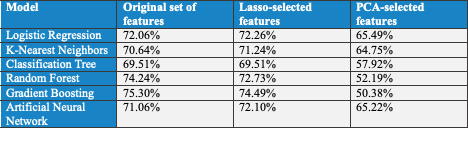

# Classifying the kickstarter projects as success or failure
In this project, I built and tested 6 supervised machine learning algorithms including logistic regression, k-nearest neighbors, classification tree, random forest, gradient boosting and artificial neural network (ANN), to predict the success of kickstarter projects.

## 🌐 About Kickstarter:
[Kickstarter](https://www.kickstarter.com/) is a platform where creators share their project visions with the communities that will come together to fund them. 

## 💼 Business Value:
For Kickstarter's managament, predicting success means planning ahead. My model helps in predicting the success of projects, guiding staff picks, to select the projects worthy of the spotlight, which can increase the visibility and popularity of the platform.

## 🛠️ Process Overview:
I followed these steps to build and test the models:
1. 📊 Data Exploration:
   - Explored the data and found that US projects accounted for 71% of the data, so I grouped the other countries as ‘Non-US’.
2. 🧹 Data Cleansing:
   - Dropped 𝑛𝑎𝑚𝑒_𝑙𝑒𝑛 and 𝑏𝑙𝑢𝑟𝑏_𝑙𝑒𝑛, keeping the cleaned versions.
   - Handled a strong correlation between pledged and 𝑢𝑠𝑑_𝑝𝑙𝑒𝑑𝑔𝑒𝑑, by dropping the former.
   - Created a new column 𝑔𝑜𝑎𝑙_𝑢𝑠𝑑 by multiplying 𝑔𝑜𝑎𝑙 and 𝑠𝑡𝑎𝑡𝑖𝑐_𝑢𝑠𝑑_𝑟𝑎𝑡𝑒.
   - Addressed missing values in 𝑐𝑎𝑡𝑒𝑔𝑜𝑟𝑦, and excluded observations with 𝑠𝑡𝑎𝑡𝑒 other than 'successful' or 'failure'.
3. 🛠️ Feature Engineering:
   - Excluded irrelevant features such as 𝑖𝑑 and 𝑛𝑎𝑚𝑒, hourly details, original date columns, and weekday columns.
   - The goal of this project is to classify a new project as successful or not, based on the information available at the moment when the project owner submits the project. So, the model should only use the predictors that are available at that time. Hence, I removed 12 columns not available at project submission, including 𝑝𝑙𝑒𝑑𝑔𝑒𝑑, 𝑢𝑠𝑑_𝑝𝑙𝑒𝑑𝑔𝑒𝑑, 𝑑𝑖𝑠𝑎𝑏𝑙𝑒_𝑐𝑜𝑚𝑚𝑢𝑛𝑖𝑐𝑎𝑡𝑖𝑜𝑛, 𝑠𝑡𝑎𝑡𝑒_𝑐h𝑎𝑛𝑔𝑒𝑑_𝑎𝑡, 𝑠𝑡𝑎𝑓𝑓_𝑝𝑖𝑐𝑘 and 𝑠𝑝𝑜𝑡𝑙𝑖𝑔h𝑡.
   - After separating the target 𝑠𝑡𝑎𝑡𝑒, I created dummies from 17 features, resulting in 39 predictors, and eliminated 3 having a correlation of 0.80 or higher. 
4. 🤖 Model Training: After splitting the dataset, I trained six classification models, and chose accuracy as the primary performance metric to predict true success and failure. I also tested models by using LASSO features and PCA components, but since those gave me a lower accuracy for RF and GBT, I chose our initial list of features as final model.

6. 🚀 Top Performer: The Gradient Boosting (GBT) Algorithm emerged as the top performer with the highest accuracy at 75.30%. 
   💡 GBT generates a large number of trees, and through its sequential tree growth (every time learning from the tree one before it), it places greater emphasis on observations with large errors, making it well-suited for this context.

## 🎉 Conclusion:
I applied the GBT model to predict the state of projects in kickstarter_grading_df.xlsx, and achieved an accuracy of 74.34%, confirming its effectiveness as the best model.
